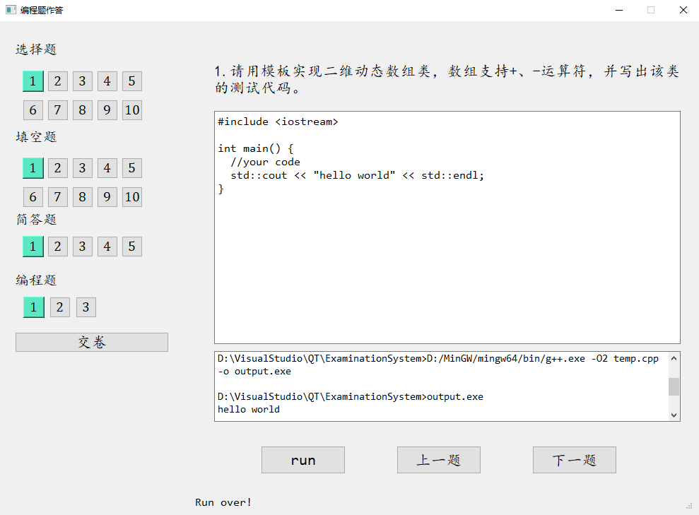
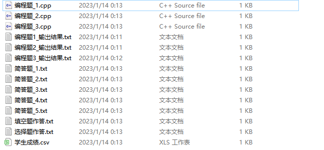
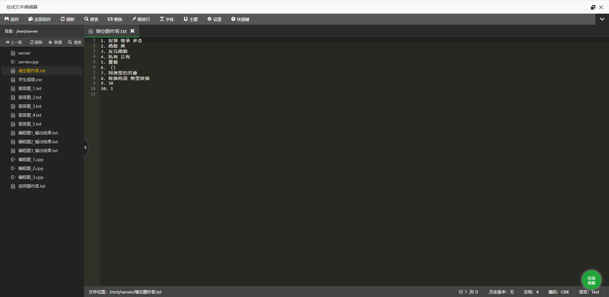

# **基于C++的考试系统设计**

本项目为hust研究生面向对象课程考试，基于C++完成了简易的考试系统设计，包含交互式答题、自动判卷以及文件传输等基本功能.

## **开发环境**
Visual Studio2019  
QT 5.14.2  
MySQL 8.0  
python 3.9  
pytorch 1.13.0

## **试题存储形式**
本项目中使用的所有试题数据以数据库形式存储，通过MySQL进行管理。所使用数据库examinationdb具体结构如下：  

- examinationdb
    - studentInfo
    - choicebank
    - fillbank
    - shortbank
    - programbank

## **答题界面**



## **自动判分**
1. 选择题  
   - 选择题判分直接将学生答案与标答进行对比
2. 填空题  
   - 答案无序：利用哈希表计分
   - 答案有序：各个空提供多个可行答案，逐个空比较学生答案与可行答案
3. 简答题
   - 简答题利用word2vec进行文本相似度计算作为判分标准，wordvec模型训练代码如下：
```python
    model_name = 'your model name'

    sentences = w2v.LineSentence('path to your training corpus after word segmentation')
    model = Word2Vec(sentences, vector_size=100, window=5, min_count=5, workers=4, epochs=1000)

    model.save(model_name)
```
4. 编程题
   - 编程题仅将学生代码是否能运行以及运行结果进行保存，未涉及判分方法  
  
## **文件传输**
学生在交卷时，系统将学生作答信息保存并进行自动判分，将作答信息与最终成绩通过socket传输到服务端。

客户端socket代码如下(Paper.h Line 298):
```cpp
WSADATA Data;
WSAStartup(MAKEWORD(2, 2), &Data);

const char* ip = /* ip */;
int port = /* port */;
int backlog = 5;

/* 创建一个IPv4地址 */
struct sockaddr_in address;
memset(&address, 0, sizeof(address));
address.sin_family = AF_INET;
inet_pton(AF_INET, ip, &address.sin_addr);  // 将ip转换成网络字节序
address.sin_port = htons(port);  // 将端口号转换成网络字节序

int cnt = 0;

while (cnt < filenames.size()) {
    // 创建socket
    int sock = socket(PF_INET, SOCK_STREAM, 0);

    if (sock < 0) {
        perror("[-]Error in socket");
        exit(1);
    }

    printf("[+]Server socket created successfully.\n");

    // 绑定socket和地址
    int ret = connect(sock, (struct sockaddr*)&address, sizeof(address));  

    if (ret == -1) {
        perror("[-]Error in socket");
        exit(1);
    }

    printf("[+]Connected to Server.\n");	

    FILE* fp = fopen(filenames[cnt].c_str(), "r");
    if (fp == NULL) {
        perror("[-]Error in reading file.");
        exit(1);
    }

    char data[BUFFER_SIZE] = { 0 };

    while (fgets(data, BUFFER_SIZE, fp) != NULL) {
        if (send(sock, data, sizeof(data), 0) == -1) {
            perror("[-]Error in sending file.");
            exit(1);
        }
        memset(data, 0, BUFFER_SIZE);
    }

    std::cout << "sending " << filenames[cnt] << std::endl;
    printf("[+]File data sent successfully.\n");

    printf("[+]Closing the connection.\n");
    closesocket(sock);

    cnt++;
}

```

**文件保存结果：**  



**文件上传结果(服务端)：**



## 环境配置注意事项
1. MySQL配置(Paper.h Line 59、ExaminationSystem.cpp Line 30)  
```cpp
QSqlDatabase db = QSqlDatabase::addDatabase("QODBC");    

db.setHostName("server ip");        
db.setDatabaseName("database name");
db.setUserName("user name");        
db.setPassword("your password");
db.setPort(3306);
```
2. g++路径配置(ProgramSurface.cpp Line 52)
   - g++路径配置主要用于编程题答题界面中代码运行功能的实现  
```cpp
process.start("cmd");
process.write("path to g++/g++.exe -O2 temp.cpp -o output.exe\n");
process.write("output.exe\n");
process.waitForStarted();
ui->console->setFocus();
ui->statusBar->showMessage(tr("Run over!"));
```
3. python与word2vec路径配置(Paper.h Line 135)
```cpp
std::string str = "python ./word2vec/main.py";

for (int i = 0; i < SHORT_NUM; i++) {
    ShortQuestion* sq = dynamic_cast<ShortQuestion*>(q[CHOICE_NUM + FILL_NUM + i]);
    std::vector<std::string> para = sq->returnPara();

    std::string arg1 = "ans" + std::to_string(i + 1) + " ";
    std::string arg2 = "student_ans" + std::to_string(i + 1) + " ";

    str += " --" + arg1 + para[0] + " --" + arg2 + para[1];
}

str += ">temp.txt";

std::system(str.c_str());
```

## **说明**
本项目实现了考试系统的基本功能，但仍有可以优化改进的地方。欢迎交流与讨论！
